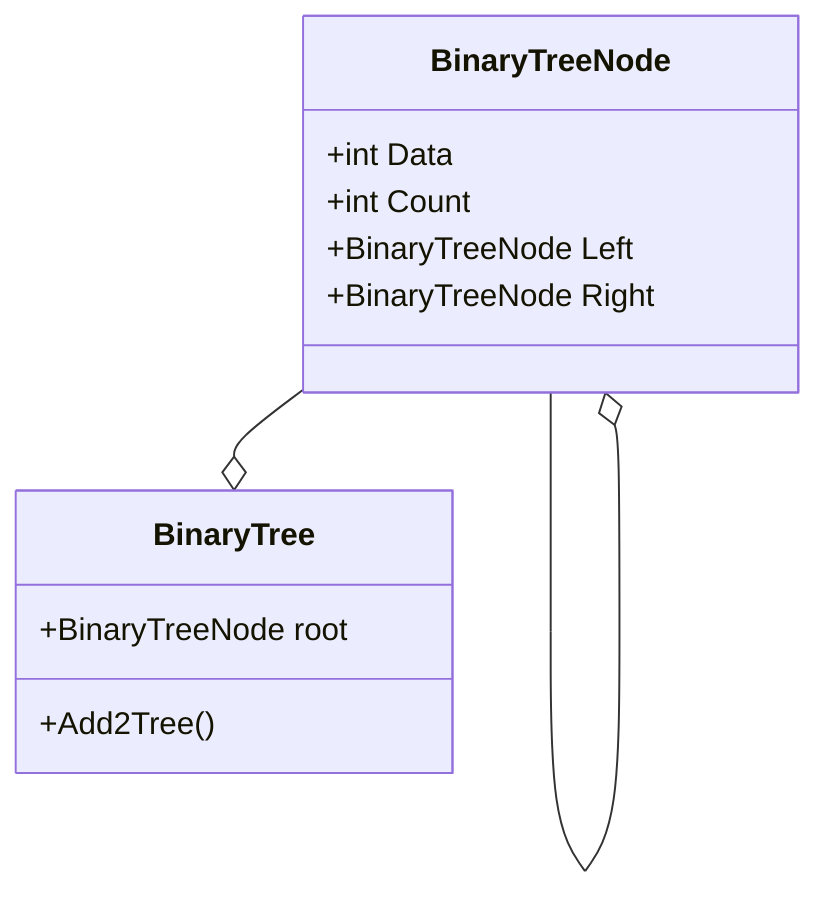

# SearchAlgorithms---JCA

This is a skeleton C# programs for writing search algorithms

Within it is a simple datastructure that can build (but not search) a Binary Search Tree.  There is 2 classes within the datastructure

Once you have created an object of type BinaryTree you can build the structure by calling the method Add2Tree and passing an array of integers as a parameter. 
  
You will then have access to a property called **Root** which is an object of type BinaryTreeNode and so has properties of Data and Count. Data is the value stored on that node.  Count is to allow for duplicate values (we can ignore it at moment)  
  
You can then navigate to the left or right subtree by using a **pointer** of type BinaryTreeNode.  TO do this also declare a pointer of type BinaryTreeNode and reassign it to your tree.Root.Right or tree.Root.Left.  
  
Also within the program is 2 arrays you can use to write search subroutines.  One is sorted in accending order and the other is in its original order  
  
You can also manipulate the number of items in the tree/arrays as well as the boundary values (see comments in code).
